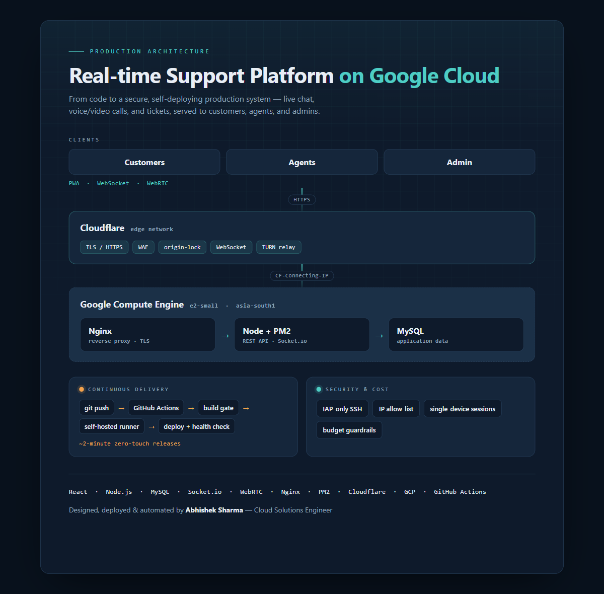

# Cloud Deployment & DevOps Automation — Real-time Support Platform

Infrastructure, deployment, and automation showcase for a production **real-time customer
support platform** (live chat, voice/video calls, tickets) running on **Google Cloud**.

> This repo documents the **cloud / DevOps / security** side of the project — the part I
> designed and operated. The application source itself is private. Everything here is
> **sanitized**: domains, IPs, account IDs and secrets are replaced with placeholders.



---

## Overview

The platform serves three roles — **customers, agents, and admins** — over live chat,
WebRTC voice/video, and a ticketing system, delivered as a PWA. My focus was taking it
from application code to a **secure, always-on, self-deploying** production system.

**Stack:** React · Node.js · MySQL · Socket.io · WebRTC · Nginx · PM2 · Cloudflare · GCP · GitHub Actions

---

## Why this architecture (the decisions that mattered)

| Decision | Why |
| --- | --- |
| **GCP Compute Engine VM** (not Cloud Run / k8s) | A single right-sized `e2-small` runs the API, WebSocket server, and MySQL together with predictable cost and **no cold starts** — important for real-time chat/calls. Cloud Run's scale-to-zero would add connection latency; Kubernetes was operational overkill for one service. |
| **Cloudflare in front, origin locked** | TLS/HTTPS, WAF, and DDoS at the edge. The VM firewall only accepts traffic from **Cloudflare IP ranges**, so the origin can't be hit directly by IP — removing a whole class of attacks. |
| **Nginx reverse proxy** | TLS termination (Cloudflare Origin Cert), WebSocket upgrade for Socket.io, large-upload limits for attachments/recordings, and **real client-IP restore** (`CF-Connecting-IP`) so app-level IP rules and rate limits see the true visitor. |
| **Identity-Aware Proxy (IAP) for SSH** | **Zero public SSH.** Admin access tunnels through Google IAP, so port 22 is closed to the internet and access is tied to Google identity + IAM. |
| **App-level IP allow-list for staff panels** | Admin/agent routes are gated to office IPs at login — flexible to change without redeploying, with a break-glass path documented for recovery. |
| **GitHub Actions + self-hosted runner** | Push-to-`main` triggers a **build gate** (fails before touching prod if install/build breaks) then a **~2-minute zero-touch deploy** with health checks. Self-hosted runner keeps the pipeline outbound-only — fits the locked-down firewall. |
| **Serverless cost guardrails** | A Cloud Billing **Budget → Pub/Sub → Cloud Function** kill-switch auto-disables billing on sandbox projects if spend runs away, plus tiered budget email alerts on production. See [`cost-guardrail/`](cost-guardrail/). |
| **Single active session per user** | "Last-login-wins" session control (rotating JWT id) so a credential can't be used on two devices at once, without locking the real owner out. |

---

## CI/CD pipeline

`git push main` → **build gate** (`npm ci` + build for backend & frontend) → **deploy**
(`git pull --ff-only` → `deploy.sh`). The deploy script backs up the database, installs,
rebuilds the frontend, and **gracefully reloads under PM2** with near-zero downtime, then
runs a health check.

- Workflow: [`ci-cd/deploy.yml`](ci-cd/deploy.yml)
- Deploy script: [`deploy.sh`](deploy.sh)

```
push → ┌─────────────┐   pass   ┌──────────────────────────────┐
       │ build gate  │ ───────▶ │ backup DB → pull → build →    │
       │ (CI)        │          │ pm2 reload → health check     │
       └─────────────┘  fail ✗  └──────────────────────────────┘
              └─ stops here, prod untouched
```

---

## Security hardening

- **No public SSH** — access only via Google IAP tunnel.
- **Origin locked to Cloudflare** — VM firewall rejects non-Cloudflare traffic.
- **Real-IP restore** at Nginx so allow-lists / rate-limits aren't fooled by the proxy.
- **IP allow-listed** admin & agent panels (login-time, editable, with break-glass recovery).
- **Single-device sessions** + generic error messages + security headers (helmet) + API rate limiting.

---

## Cost controls

See [`cost-guardrail/`](cost-guardrail/) for the serverless budget kill-switch
(Cloud Billing Budget → Pub/Sub → Cloud Run Function → Cloud Billing API). Production
uses **alerts only**; sandbox projects get the automatic shut-off.

---

## Repo layout

```
cloud-support-platform-infra/
├── docs/architecture.png      # system diagram
├── ci-cd/deploy.yml           # GitHub Actions workflow (self-hosted runner)
├── nginx/site.conf            # reverse proxy + Cloudflare real-IP + WebSocket
├── deploy.sh                  # zero-downtime deploy script
└── cost-guardrail/            # GCP budget auto-shutoff (Pub/Sub + Cloud Function)
```

---

*Sanitized for portfolio use. Replace every `example.com`, placeholder IP, and `*_ID`
with real values before using any of this against live infrastructure.*
